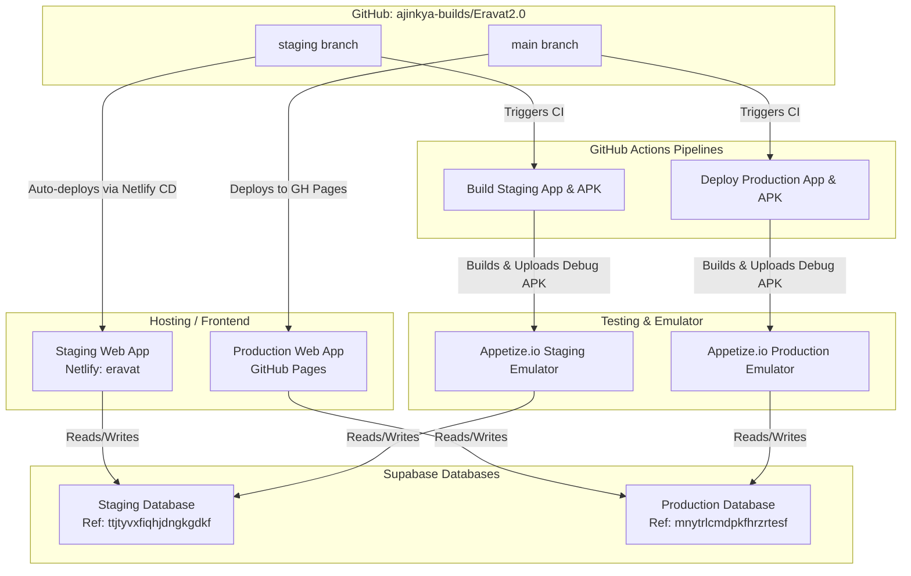

# Eravat 2.0 DevOps Summary & Staging Architecture

This file summarizes the DevOps modifications made during this session to establish a 100% automated, free-tier staging environment alongside the existing production environment.

## 🏗️ Architecture Design

---

## 🔑 Environment Mappings & Settings

### 1. Databases (Supabase)
* **Production Database**:
  * Project Ref: `mnytrlcmdpkfhrzrtesf`
  * Region: `ap-south-1` (Mumbai)
* **Staging Database**:
  * Project Ref: `ttjtyvxfiqhjdngkgdkf`
  * Region: `ap-south-1` (Mumbai)
  * Restored with Eravat 2.0 production database schema, row data (reports, observations, profiles), and auth users.

### 2. Web Hosting
* **Production Web (GitHub Pages)**:
  * URL: [ajinkya-builds.github.io/Eravat2.0](https://ajinkya-builds.github.io/Eravat2.0)
  * Target Branch: `main`
* **Staging Web (Netlify)**:
  * URL: [eravat.netlify.app](https://eravat.netlify.app)
  * Target Branch: `staging`
  * Project ID: `699fa7d6-25a0-4fd9-98d6-6ae366ae1869`
  * Environment variables configured on Netlify:
    * `VITE_SUPABASE_URL`: `https://ttjtyvxfiqhjdngkgdkf.supabase.co`
    * `VITE_SUPABASE_PUBLISHABLE_KEY`: (Staging publishable key)

### 3. GitHub Secrets
The following secrets are configured in the GitHub repository to run CI/CD pipelines successfully:
* `APPETIZE_API_TOKEN`: Used to upload APKs to Appetize.io.
* `STAGE_VITE_SUPABASE_URL`: `https://ttjtyvxfiqhjdngkgdkf.supabase.co` (Staging Supabase URL)
* `STAGE_VITE_SUPABASE_PUBLISHABLE_KEY`: (Staging publishable key)
* `VITE_SUPABASE_URL`: `https://mnytrlcmdpkfhrzrtesf.supabase.co` (Production Supabase URL)
* `VITE_SUPABASE_PUBLISHABLE_KEY`: (Production publishable key)

---

## 📱 Appetize Emulator Links

* **Staging Emulator URL**: [Launch Staging Emulator](https://appetize.io/app/rthbx63kdvramzsyvwmxthkqd4)
* **Production Emulator URL**: [Launch Production Emulator](https://appetize.io/app/oavntln3glgkubshddhtmv7gmy)

---

## 🔍 Troubleshooting Staging Issues

If staging is not loading or auth/data flows are failing, here are the key areas to investigate:

1. **Authentication (Supabase GoTrue):**
   * Since users were imported from the production database, auth passwords should match production credentials.
   * Check if the user email has been confirmed in the staging Supabase Auth dashboard (`ttjtyvxfiqhjdngkgdkf`). If not, confirm them manually or disable email confirmation in Supabase Auth settings.

2. **Network/CORS Configuration on Staging Supabase:**
   * Go to Supabase Staging Project -> API Settings.
   * Ensure `CORS Allowed Origins` allows `https://eravat.netlify.app` and `localhost` (for emulator/local testing).

3. **Netlify Redirects/Headers:**
   * Single Page Applications (React/Vite) require redirects configured for client-side routing. Check if accessing a sub-page (e.g. `/dashboard` directly) causes a 404. If so, a `_redirects` file needs to be present in Netlify's publish folder with `/* /index.html 200`.

4. **Appetize Emulator Build API Version:**
   * The staging emulator loads the debug APK built via GitHub Actions. If there are crashes, fetch the emulator console logs from the Appetize dashboard.
