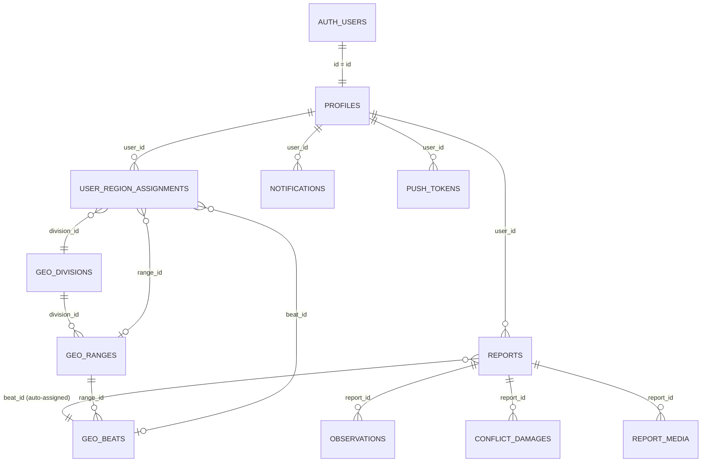
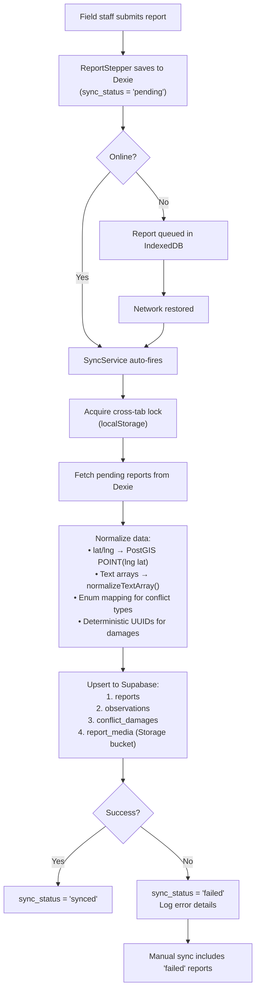
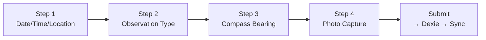

# 🧠 ERAVAT 2.0 — PROJECT BRAIN

> **Generated:** 2026-05-21  
> **Source:** Full codebase analysis + all `/docs` files + session history  
> **Purpose:** Single authoritative reference for understanding every aspect of the project

---

## Table of Contents

1. [Mission & Context](#1-mission--context)
2. [Tech Stack (Verified from Code)](#2-tech-stack-verified-from-code)
3. [Project Structure](#3-project-structure)
4. [Database Schema & Spatial Architecture](#4-database-schema--spatial-architecture)
5. [Authentication System](#5-authentication-system)
6. [RBAC — Role-Based Access Control](#6-rbac--role-based-access-control)
7. [Offline-First Architecture & Sync Pipeline](#7-offline-first-architecture--sync-pipeline)
8. [Routing Map (Complete)](#8-routing-map-complete)
9. [Report Submission Flow](#9-report-submission-flow)
10. [Notification System](#10-notification-system)
11. [Map System](#11-map-system)
12. [Admin Command Center](#12-admin-command-center)
13. [Dashboard Metrics & KPIs](#13-dashboard-metrics--kpis)
14. [Design System & Theming](#14-design-system--theming)
15. [Internationalization (i18n)](#15-internationalization-i18n)
16. [State Management](#16-state-management)
17. [Edge Functions (Supabase)](#17-edge-functions-supabase)
18. [Database Triggers & Stored Procedures](#18-database-triggers--stored-procedures)
19. [GIS Data Pipeline](#19-gis-data-pipeline)
20. [Testing Infrastructure](#20-testing-infrastructure)
21. [Deployment & CI/CD](#21-deployment--cicd)
22. [Deferred Capabilities (Planned)](#22-deferred-capabilities-planned)
23. [Environment Variables](#23-environment-variables)
24. [Known Issues & Technical Debt](#24-known-issues--technical-debt)
25. [Documentation Gaps Identified](#25-documentation-gaps-identified)
26. [Security Posture](#26-security-posture)
27. [Suggested Roadmap Summary](#27-suggested-roadmap-summary)

---

## 1. Mission & Context

**Eravat 2.0** is a mobile-first Progressive Web App (PWA) for the **Madhya Pradesh Forest Department** to digitize wild elephant monitoring across the state.

### What it does
- Field staff (beat guards, range officers) log **sightings**, **indirect signs**, and **human-wildlife conflict damage** from deep forest areas
- Data syncs to a centralized Supabase backend when connectivity is available
- Officers and biologists get **real-time dashboards**, **proximity alerts**, and **territory-scoped analytics**

### Key Design Constraints
- **Offline-first**: Forest areas have zero to intermittent connectivity
- **Territory-aware**: Data is scoped via PostGIS spatial queries to divisions → ranges → beats
- **Role-based**: 9 distinct roles from Admin down to Volunteer, each with different data access
- **Mobile-native**: Android builds via Capacitor 8.0, also runs as PWA in browser
- **India-specific**: Phone-based auth with country code `+91`, DLT-registered SMS compliance, Hindi/Marathi i18n

### Geography Scale
- **11 divisions** → **80 ranges** → **1,222 beats** (seeded from MP government shapefiles)

---

## 2. Tech Stack (Verified from Code)

> [!IMPORTANT]
> Existing docs (README, SOURCE_OF_TRUTH) list **React 18** and **React Router v6**. The actual code uses **React 19** and **React Router v7**. This is a critical documentation drift.

| Layer | Technology | Version (from package.json) |
|-------|-----------|----------------------------|
| **UI Framework** | React | **19** |
| **Language** | TypeScript | 5+ (strict mode) |
| **Build Tool** | Vite | Latest (SWC compiler) |
| **Styling** | Tailwind CSS | **v4** (`@tailwindcss/vite` plugin) |
| **Animation** | Framer Motion | Latest |
| **Routing** | React Router DOM | **v7** |
| **Backend** | Supabase | PostgreSQL 15 + PostGIS |
| **Auth** | Supabase Auth | Phone/Email + TOTP MFA |
| **Offline DB** | Dexie.js | IndexedDB wrapper |
| **Maps** | Leaflet + react-leaflet | With Turf.js + WKX (WKB parsing) |
| **Charts** | Recharts | Latest |
| **i18n** | i18next + react-i18next | 3 languages inline |
| **Icons** | Lucide React | Latest |
| **Native** | Capacitor | 8.0 (Android SDK 34/35) |
| **Testing** | Playwright (E2E) + Vitest (unit) | Latest |
| **Linting** | ESLint | Flat config + react-hooks/refresh plugins |

**Supabase Project ID:** `mnytrlcmdpkfhrzrtesf`  
**App Bundle ID:** `com.forestdept.eravat`

---

## 3. Project Structure

```
/Volumes/Eravat/Eravat 2.0/
├── .env / .env.local              # Supabase + Twilio credentials (⚠️ real keys)
├── .github/workflows/deploy.yml   # GitHub Pages CI/CD
├── data/Shape_Files/              # GIS shapefiles (BTR, STR, MP boundaries)
│   ├── BTR/                       # Bandhavgarh Tiger Reserve
│   ├── STR/                       # Satpura Tiger Reserve
│   └── Shp file/                  # State-wide beat boundaries
├── docs/                          # All documentation (this directory)
│   └── sessions/                  # 21 session logs (chronological dev history)
├── scripts/
│   ├── create_admin_user.sql      # Manual admin user creation SQL
│   └── process_missing_divisions.py # Shapefile → SQL generator
├── supabase/
│   ├── config.toml                # Supabase local config
│   ├── functions/                 # Deno Edge Functions
│   │   ├── create-user/index.ts
│   │   ├── update-user/index.ts
│   │   ├── delete-user/index.ts
│   │   ├── send-push/index.ts
│   │   └── _shared/rbac.ts       # Centralized role hierarchy
│   ├── migrations/                # 30 SQL migration files
│   ├── scripts/                   # SQL triggers (spatial, notifications)
│   └── seeds/                     # 18.8MB MP geography data + shp_to_sql.py
└── eravat-app/                    # Main React application
    ├── src/
    │   ├── App.tsx                # All route definitions
    │   ├── main.tsx               # App entry + providers
    │   ├── db.ts                  # Dexie.js schema (offline store)
    │   ├── supabase.ts            # Supabase client init
    │   ├── i18n.ts                # i18next config + ALL translations (36KB)
    │   ├── index.css              # Tailwind + glassmorphism design tokens
    │   ├── admin/
    │   │   └── deferredCapabilities.ts  # 14 planned features
    │   ├── components/
    │   │   ├── ProtectedRoute.tsx       # Auth guard
    │   │   ├── admin/AdminShared.tsx     # Admin shell components
    │   │   ├── reporting/               # ReportStepper + 4 step components
    │   │   │   ├── ReportStepper.tsx     # Multi-step wizard controller
    │   │   │   ├── DateTimeLocation.tsx  # Step 1
    │   │   │   ├── ObservationType.tsx   # Step 2
    │   │   │   ├── CompassBearing.tsx    # Step 3
    │   │   │   └── Photo.tsx            # Step 4
    │   │   ├── shared/
    │   │   │   ├── MapComponent.tsx      # Leaflet map (525 lines)
    │   │   │   ├── NotificationBell.tsx  # Real-time notification badge
    │   │   │   └── RadiusSlider.tsx      # Notification radius control
    │   │   └── ui/                      # Shared UI primitives
    │   ├── contexts/
    │   │   ├── AuthContext.tsx           # Auth state (15KB)
    │   │   ├── LanguageContext.tsx       # Language switching
    │   │   ├── ThemeContext.tsx          # Dark/light mode
    │   │   └── ActivityFormContext.tsx   # Report form state
    │   ├── hooks/
    │   │   ├── useGeolocation.ts         # Capacitor GPS
    │   │   ├── useCamera.ts             # Capacitor camera
    │   │   └── useAdminFilters.ts       # Admin filter state
    │   ├── layouts/admin/
    │   │   └── AdminLayout.tsx          # Sidebar + outlet
    │   ├── lib/
    │   │   ├── utils.ts                 # cn() helper (clsx + tailwind-merge)
    │   │   └── publicAsset.ts           # Base-aware asset URLs
    │   ├── pages/
    │   │   ├── Login.tsx                # 43KB — Phone/Email/OTP login
    │   │   ├── Dashboard.tsx            # Field user dashboard
    │   │   ├── AdminDashboard.tsx        # 34KB — Admin command center
    │   │   ├── MapPage.tsx              # Full-screen territory map
    │   │   ├── ReportActivityPage.tsx   # Report wizard host
    │   │   ├── TerritoryHistory.tsx     # Historical sightings list
    │   │   ├── UserProfile.tsx          # User profile view
    │   │   └── admin/                   # 9 admin sub-pages
    │   │       ├── AdminConflictDashboard.tsx
    │   │       ├── AdminDivisions.tsx    # 38KB
    │   │       ├── AdminLatestEntries.tsx
    │   │       ├── AdminLiveDashboard.tsx
    │   │       ├── AdminNotifications.tsx
    │   │       ├── AdminObservations.tsx
    │   │       ├── AdminSettings.tsx
    │   │       ├── AdminUsers.tsx        # 41KB
    │   │       └── AdminUserStats.tsx
    │   ├── services/
    │   │   ├── syncService.ts           # 16KB — Offline→Supabase sync
    │   │   ├── NotificationService.ts   # In-app notification logic
    │   │   ├── PushNotificationService.ts # FCM push registration
    │   │   └── adminAnalyticsService.ts  # Dashboard data aggregation
    │   ├── types/
    │   │   └── activity-report.ts       # Report type definitions
    │   └── utils/
    │       └── test-utils.tsx           # Testing helpers
    ├── tests/                           # 21 Playwright E2E specs
    └── playwright/                      # Auth state storage
```

---

## 4. Database Schema & Spatial Architecture

### Enum Types

```sql
CREATE TYPE user_role AS ENUM (
  'admin', 'ccf', 'biologist', 'veterinarian',
  'dfo', 'rrt', 'range_officer', 'beat_guard', 'volunteer'
);

CREATE TYPE obs_type AS ENUM (
  'direct_sighting', 'indirect_sign', 'conflict_loss'
);

CREATE TYPE sync_status AS ENUM (
  'pending', 'synced', 'reviewed'
);

CREATE TYPE loss_category AS ENUM (...);  -- ⚠️ Values NOT listed in any doc
```

> [!WARNING]
> The `loss_category` enum values are **not explicitly documented** anywhere. The sync service maps UI labels to DB-safe enum values, but the actual enum definition must be checked in the migrations.

### Entity Relationship Diagram



### Table Details

#### `profiles`
| Column | Type | Notes |
|--------|------|-------|
| id | UUID | = auth.users.id (NOT a separate FK) |
| role | user_role | Enum |
| phone | TEXT | Format: `91XXXXXXXXXX` (no +, enforced by trigger) |
| first_name | TEXT | |
| last_name | TEXT | |
| is_active | BOOLEAN | Soft-disable for access revocation |
| notification_radius_km | INTEGER | Range 1–500, default 10 |
| latitude | DOUBLE PRECISION | Required WGS84; backfilled from territory centroid |
| longitude | DOUBLE PRECISION | Required WGS84 |
| location_updated_at | TIMESTAMPTZ | Set when coordinates change |
| created_at | TIMESTAMPTZ | |

> [!IMPORTANT]
> **RLS is OFF** on profiles. Any authenticated user can read all profiles. This is a known gap flagged for fixing.

#### `reports`
| Column | Type | Notes |
|--------|------|-------|
| id | UUID | PK |
| user_id | UUID | FK → profiles |
| location | geography(POINT, 4326) | PostGIS — NOT separate lat/lng columns |
| device_timestamp | TIMESTAMPTZ | Local device time at report creation |
| beat_id | UUID | FK → geo_beats, auto-assigned by trigger |
| status | sync_status | pending → synced → reviewed |
| notes | TEXT | Free-form notes |

**RLS: ON** — Geographic + role-based policies

#### `observations`
| Column | Type | Notes |
|--------|------|-------|
| id | UUID | PK |
| report_id | UUID | FK → reports |
| type | obs_type | direct_sighting / indirect_sign / conflict_loss |
| male_count | INTEGER | For direct_sighting |
| female_count | INTEGER | For direct_sighting |
| calf_count | INTEGER | For direct_sighting |
| unknown_count | INTEGER | For direct_sighting |
| total_elephants | INTEGER | Sum of all counts |
| compass_bearing | NUMERIC | 0–360° |
| indirect_sign_details | TEXT[] | Array of sign types |
| conflict_loss_details | TEXT[] | Array of loss types |

**RLS: ON** — Inherits from reports

#### `conflict_damages`
| Column | Type | Notes |
|--------|------|-------|
| id | UUID | **Explicit UUID required** (not auto-generated) |
| report_id | UUID | FK → reports |
| category | loss_category | Enum (values undocumented) |
| description | TEXT | |
| estimated_value | NUMERIC | |

**RLS: OFF** ⚠️

#### `report_media`
| Column | Type | Notes |
|--------|------|-------|
| id | UUID | PK |
| report_id | UUID | FK → reports |
| file_data / file_path / storage_path / path | TEXT | ⚠️ Column name varies — schema drift |
| mime_type | TEXT | Normalized (image/jpg → image/jpeg) |
| created_at | TIMESTAMPTZ | |

> [!WARNING]
> The file path column name is inconsistent across environments. The sync service uses `mediaPathColumnHint` with trial-and-error fallback logic to handle this.

**RLS: OFF** ⚠️

#### `geo_divisions` / `geo_ranges` / `geo_beats`
| Column | Type | Notes |
|--------|------|-------|
| id | UUID | PK |
| name | TEXT | Territory name |
| parent_id | UUID | FK to parent table (except divisions) |
| boundary | geography(POLYGON/MULTIPOLYGON) | PostGIS boundary |
| centroid | geography(POINT) | Auto-populated via ST_Centroid trigger |

**RLS: OFF** on all three ⚠️ — Any authenticated user can enumerate all territories

#### `user_region_assignments`
| Column | Type | Notes |
|--------|------|-------|
| user_id | UUID | FK → profiles |
| division_id | UUID | FK → geo_divisions |
| range_id | UUID | FK → geo_ranges (nullable) |
| beat_id | UUID | FK → geo_beats (nullable) |
| is_primary_contact | BOOLEAN | For chain-of-command notifications |

**RLS: OFF** ⚠️

#### `notifications`
| Column | Type | Notes |
|--------|------|-------|
| id | UUID | PK |
| user_id | UUID | FK → profiles |
| report_id | UUID | FK → reports |
| title | TEXT | |
| message | TEXT | Enriched with Beat/Range names |
| is_read | BOOLEAN | |
| notification_type | TEXT | chain_of_command / proximity / general |
| created_at | TIMESTAMPTZ | |

**RLS: ON** — Users can only read/update their own notifications

#### `push_tokens`
| Column | Type | Notes |
|--------|------|-------|
| user_id | UUID | FK → profiles |
| token | TEXT | FCM registration token |
| platform | TEXT | android / web |

> [!NOTE]
> The `push_tokens` table is **not documented** in schema.md or any existing doc. It was found only in the codebase (PushNotificationService.ts + send-push Edge Function).

### Spatial Logic

**Beat Auto-Assignment** (`assign_report_geography()` trigger):
1. Primary: `ST_Intersects(NEW.location, beat.boundary)` — GPS point falls within a beat polygon
2. Fallback: `ST_Distance(NEW.location, beat.boundary)` — Nearest boundary when GPS is outside all polygons (common at forest edges)

**Proximity Notifications:**
- `ST_DWithin(report.location, user_region.centroid, user.notification_radius_km * 1000)`
- Converts km to meters for PostGIS calculation

---

## 5. Authentication System

### Current Implementation (Live)

**Phone/Password Login (two-step):**
```
User enters phone number
  → Normalize to 91XXXXXXXXXX (strip +, country code handling)
  → RPC: get_email_by_phone(phone) — fuzzy last-10-digit match
  → Returns synthetic email (phone@eravat.local or similar)
  → supabase.auth.signInWithPassword(email, password)
  → AuthContext loads profile from profiles table
  → ProtectedRoute checks session + profile validity
```

**OTP Login (available but costly):**
- Uses Twilio for SMS delivery
- Unreliable in India without DLT registration
- Cost: ₹0.5–1.0 per OTP × daily logins = significant expense

**MFA (Admin only):**
- TOTP-based MFA via `supabase.auth.mfa`
- Enforced only for users with `role === 'admin'`

> [!IMPORTANT]
> **Undocumented in existing docs:** Admin MFA enforcement is implemented in AuthContext.tsx but not mentioned in AUTH_ARCHITECTURE.md or SOURCE_OF_TRUTH.

### Proposed Future: Hybrid Offline-First Auth (AUTH_ARCHITECTURE.md — DRAFT)

**Three-layer model:**

| Layer | Purpose | When | How |
|-------|---------|------|-----|
| **1. Enrollment** | Initial identity verification | Online, infrequent | Phone OTP via MSG91 (DLT-registered) → set 6-digit PIN |
| **2. Unlock** | Daily access | Offline-capable | Local PIN → Argon2id KDF → AES-GCM decrypt wrapped refresh token |
| **3. Reconciliation** | Token refresh + sync | Online, opportunistic | Refresh Supabase session, sync data, check `is_active` |

**Key design decisions in the proposal:**
- PIN-derived key wrapping (not hash-compare) for defense-in-depth
- Android Keystore for hardware-backed outer encryption
- Lockout: 5 fails → 30s, 10 fails → 30min, 15 fails → full wipe
- Forced re-verification every 14 days (tunable per role)
- Custom JWT claims: role, is_active, max_offline_days, region_id
- New tables: `user_devices`, `otp_audit_log`
- Profile additions: `max_offline_days`, `pin_required`, `pin_min_length`

**Status: NOT IMPLEMENTED** — 11 design decisions still pending, ~6 week estimated effort

---

## 6. RBAC — Role-Based Access Control

### Role Hierarchy

```
┌──────────────────────────────────────────────────────────┐
│  ADMIN         │ Full access — all data, all operations  │
│  CCF           │ State-level — all data (intended: read)  │
├──────────────────────────────────────────────────────────┤
│  BIOLOGIST     │ State-level — research access            │
│  VETERINARIAN  │ State-level — medical response           │
├──────────────────────────────────────────────────────────┤
│  DFO           │ Division-scoped                          │
│  RRT           │ Division-scoped (Rapid Response Team)    │
├──────────────────────────────────────────────────────────┤
│  RANGE_OFFICER │ Range-scoped                             │
│  BEAT_GUARD    │ Beat-scoped                              │
├──────────────────────────────────────────────────────────┤
│  VOLUNTEER     │ Own reports only                         │
└──────────────────────────────────────────────────────────┘
```

### Who Can Manage Whom (from `rbac.ts`)

| Manager Role | Can Create/Edit/Delete |
|-------------|----------------------|
| admin, ccf | ALL roles (wildcard `*`) |
| dfo | range_officer, beat_guard, volunteer |
| range_officer | beat_guard, volunteer |
| rrt | beat_guard only |
| beat_guard | volunteer (field onboarding `/volunteers/onboard`) |
| biologist, veterinarian, volunteer | NOBODY |

### Geographic Requirements for User Creation

| Role | Required Fields |
|------|----------------|
| dfo | division_id |
| range_officer | division_id + range_id |
| beat_guard | division_id + range_id + beat_id |
| admin, ccf, biologist, veterinarian | None (state-wide) |

### Three Parallel Enforcement Points ⚠️

> [!CAUTION]
> RBAC is enforced in THREE separate systems that **don't always agree**:
> 1. **Route Guards** (App.tsx): `/admin/*` routes check `role === 'admin'` — only admin gets admin panel
> 2. **RLS Policies** (PostgreSQL): Geographic + role-based row filtering on reports/observations
> 3. **Edge Function RBAC** (rbac.ts): User lifecycle operations (create/update/delete)
>
> **Known conflict:** Range Officers get RLS-scoped reads and `useAdminFilters` treats them like DFOs, but the route guard blocks them from `/admin`. This is the **single largest product misalignment** in the system.

---

## 7. Offline-First Architecture & Sync Pipeline

### Local Database (Dexie.js)

```typescript
// db.ts schema
reports: id, user_id, sync_status, device_timestamp, latitude, longitude, ...
report_media: id, report_id, file_data (base64), mime_type, sync_status
```

### Sync Flow



### Sync Policies
- **Auto-sync:** Processes only `pending` reports
- **Manual sync:** Includes `failed` reports for operator remediation
- **Dashboard badge:** Shows pending count only

### Cross-Tab Lock ⚠️
> [!NOTE]
> **Undocumented:** The sync service uses `localStorage`-based locking to prevent concurrent sync operations across browser tabs. This is critical for data integrity but not mentioned in SYNC_RUNBOOK.md.

### Known Error Patterns

| Error Code | Cause | Fix |
|-----------|-------|-----|
| `PGRST204` on report_media | Column name drift (`file_path` vs `storage_path` vs `path`) | Trial-and-error column discovery with `mediaPathColumnHint` caching |
| `22P02` on observations | Malformed array literal | `normalizeTextArray()` before upsert |
| Enum errors on conflict_damages | UI labels ≠ DB enum values | Explicit mapping + deterministic UUID generation |
| Media upload failures | MIME inconsistency | `image/jpg` → `image/jpeg` normalization |

---

## 8. Routing Map (Complete)

> [!NOTE]
> **This complete routing map was NOT documented anywhere** in the existing docs. It was reconstructed from `App.tsx`.

### Public Routes

| Path | Component | Purpose |
|------|-----------|---------|
| `/login` | Login.tsx | Phone/Email/OTP login (43KB) |

### Protected Routes (Any authenticated user)

| Path | Component | Layout | Purpose |
|------|-----------|--------|---------|
| `/` | Dashboard.tsx | AppLayout | Field user home — KPIs + recent activity |
| `/report` | ReportActivityPage.tsx | AppLayout | 4-step report wizard |
| `/map` | MapPage.tsx | AppLayout | Full-screen territory map with observations |
| `/history` | TerritoryHistory.tsx | AppLayout | Historical sightings list |
| `/profile` | UserProfile.tsx | AppLayout | User profile view |
| `/profile/edit` | EditProfile | AppLayout | Edit profile details |
| `/settings` | Settings | AppLayout | App settings |
| `/help` | HelpSupport | AppLayout | Help & support |
| `/privacy` | Privacy | AppLayout | Privacy policy |

### Admin Routes (admin role only)

| Path | Component | Layout | Purpose |
|------|-----------|--------|---------|
| `/admin` | AdminDashboard.tsx | AdminLayout | Command center — KPIs + charts (34KB) |
| `/admin/conflict` | AdminConflictDashboard | AdminLayout | Conflict-focused dashboard |
| `/admin/live` | AdminLiveDashboard | AdminLayout | Real-time activity feed |
| `/admin/latest` | AdminLatestEntries | AdminLayout | Latest data entries |
| `/admin/user-stats` | AdminUserStats | AdminLayout | User activity statistics |
| `/admin/users` | AdminUsers | AdminLayout | User management CRUD (41KB) |
| `/admin/divisions` | AdminDivisions | AdminLayout | Territory management (38KB) |
| `/admin/observations` | AdminObservations | AdminLayout | Observation data management |
| `/admin/notifications` | AdminNotifications | AdminLayout | Notification management |
| `/admin/settings` | AdminSettings | AdminLayout | Admin-level settings |

### Navigation

- **Bottom Navigation Bar** (AppLayout): Dashboard, Report, Map, Profile
- **⚠️ History page (`/history`) is NOT in bottom nav** — accessible only via dashboard link

---

## 9. Report Submission Flow

### 4-Step Wizard (ReportStepper + ActivityFormContext)



#### Step 1: DateTimeLocation
- Date/time picker (defaults to now)
- GPS acquisition via Capacitor Geolocation plugin
- Shows lat/lng coordinates on mini-map

#### Step 2: ObservationType
Three mutually exclusive types:

| Type | Fields |
|------|--------|
| **Direct Sighting** | Male count, Female count, Calf count, Unknown count |
| **Indirect Sign** | Multi-select: Pugmark, Dung, Broken Branches, Sound, Eyewitness |
| **Conflict/Loss** | Multi-select: Property, Crop, Livestock, Fencing, Solar Panels, FD Establishment, Other |

#### Step 3: CompassBearing
- Device compass heading (0–360°)
- Optional — user can skip

#### Step 4: Photo
- Camera capture via Capacitor Camera plugin
- Supports JPEG, PNG, WebP
- Max file size: 5MB
- Stored as base64 in Dexie, uploaded to Supabase Storage bucket `report-media` on sync

#### On Submit
1. Save to Dexie with `sync_status = 'pending'`
2. Auto-trigger sync if online
3. Navigate to home after 2-second success animation

---

## 10. Notification System

### Three Notification Types

| Type | Trigger | Recipients |
|------|---------|-----------|
| **Chain of Command** | DB trigger on report INSERT | Range Officer + DFO in report's territory |
| **Proximity** | DB trigger checks ST_DWithin | Users within `notification_radius_km` of report location |
| **General** | Admin-initiated | Targeted users |

### Implementation Layers

1. **Database Triggers** (AFTER INSERT on observations/conflict_damages):
   - Fetch Beat/Range names for human-readable alert messages
   - Insert rows into `notifications` table

2. **Real-time Subscriptions** (Supabase Realtime):
   - `NotificationBell.tsx` subscribes to `postgres_changes` on `notifications` table
   - Filtered by `user_id = current_user`
   - Shows unread count badge

3. **Push Notifications** (FCM):
   - `PushNotificationService.ts` registers FCM token via Capacitor
   - Token stored in `push_tokens` table
   - `send-push` Edge Function dispatches via FCM API

> [!NOTE]
> **Undocumented:** The `push_tokens` table and `send-push` Edge Function are not mentioned in any existing documentation. The full push notification pipeline was discovered only in the codebase.

---

## 11. Map System

**Component:** `MapComponent.tsx` (525 lines)

### Features
- **Base tiles:** CartoDB Voyager (clean, label-rich)
- **3-tier overlays:** Division → Range → Beat boundaries from PostGIS
- **WKB parsing:** `wkx` library + Node.js `Buffer` to parse hex-encoded PostGIS boundaries
- **Boundary computation:** `@turf/turf` union operations for division/range aggregation
- **Observation pins:** Color-coded by type:
  - 🟢 Emerald: Direct sighting
  - 🟡 Amber: Indirect sign
  - 🔴 Red: Conflict/loss
- **Pin filter:** Toggle all / direct / indirect / loss
- **Data cap:** 300 most recent observation pins fetched
- **Responsive:** Full-screen on `/map`, embedded mini-map on dashboard

---

## 12. Admin Command Center

### Dashboard (AdminDashboard.tsx — 34KB)

**5 overlapping admin dashboards** (consolidation recommended):
1. `/admin` — General overview (KPIs + charts)
2. `/admin/live` — Real-time activity
3. `/admin/latest` — Latest data entries
4. `/admin/conflict` — Conflict-focused view
5. `/admin/observations` — Observation data tables

### Admin Capabilities
- **User Management** (`/admin/users` — 41KB): CRUD users via Edge Functions, assign roles + territories
- **Territory Management** (`/admin/divisions` — 38KB): View/manage division → range → beat hierarchy
- **Notification Management** (`/admin/notifications`): Send general notifications
- **Settings** (`/admin/settings`): System configuration
- **User Statistics** (`/admin/user-stats`): Activity reporting

### AdminShared Components
- Sidebar navigation with icon + label
- Deferred capability badges (14 locked features)
- Role-based menu filtering

---

## 13. Dashboard Metrics & KPIs

### Data Windows
- **Primary:** Last 30 days of reports (by `device_timestamp`), hard cap 500 rows
- **Trend:** Last 7 days (derived from same dataset)

> [!WARNING]
> The 500-row cap could undercount in high-volume periods. No pagination strategy is documented.

### Core KPI Cards (All Users)

| KPI | Calculation |
|-----|------------|
| Sightings Today | Count of reports where date(device_timestamp) == today |
| Active Conflicts | Count of 30d reports where type == conflict_loss |
| Elephants Sighted | Sum of male+female+calf+unknown for today's direct sightings |
| Total Personnel | Count of all rows in profiles table |

### Role-Specific KPI Cards

| Role | KPI | Thresholds |
|------|-----|-----------|
| Biologist | Calf Representation % (7d) | ✅ ≥20%, ⚠️ 10-20%, 🔴 <10% |
| Wildlife Conservation | Coexistence Pressure (30d conflict %) | ✅ <15%, ⚠️ 15-30%, 🔴 ≥30% |
| Veterinary | Emergency Signal (high-severity keyword count) | ✅ 0, ⚠️ 1-2, 🔴 ≥3 |
| Forest Official | Hotspot Concentration (top beat %) | ✅ <30%, ⚠️ 30-50%, 🔴 >50% |

### Visual Panels

| Panel | Chart Type | Data Window |
|-------|-----------|-------------|
| 7-Day Activity Trend | Line chart (by observation type) | 7 days |
| Observation Types | Donut chart | 30 days |
| Sightings by Beat | Horizontal bar (top 6 beats) | 30 days |
| Elephant Count Breakdown | Stacked bar (by sex/age) | 7 days |
| Indirect Sign Types | Tag frequency with progress bars | 30 days |
| Recent Alerts Feed | List (newest 8 reports) | Recent |

---

## 14. Design System & Theming

### Theme Architecture
- **HSL-based dual mode:** Light + Dark themes via CSS custom properties
- **Primary palette:** Emerald/teal gradient family
- **Controlled by:** `ThemeContext.tsx` — persists preference to localStorage

### Glass Effects (Glassmorphism)
```css
.glass-card {
  background: rgba(255, 255, 255, 0.1);
  backdrop-filter: blur(10px);
  border: 1px solid rgba(255, 255, 255, 0.2);
}
```

### Typography
- **Heading font:** Outfit
- **Body font:** Inter
- Both loaded from Google Fonts

### Custom Animations (index.css)
- `fade-in` — Opacity 0→1
- `slide-in-bottom` — Translate Y + fade
- `scale-in` — Scale 0.95→1 + fade
- `accordion` — Max-height animation

### Premium Shadows
- Multi-layer box shadows for depth
- Consistent elevation system

> [!NOTE]
> **Undocumented:** The complete design system (glass effects, animation keyframes, shadow definitions, HSL tokens) exists only in `index.css`. No design system documentation exists.

---

## 15. Internationalization (i18n)

### Implementation
- **Library:** i18next + react-i18next (NOT custom LanguageContext as some docs claim)
- **Languages:** English (en), Hindi (hi), Marathi (mr)
- **Translation file:** `i18n.ts` — 36KB single file with all translations inline
- **Language switching:** Via `LanguageContext.tsx` which wraps i18next

### Known i18n Gaps
- MapPage — untranslated
- Sync status messages — untranslated
- Loader text — untranslated
- Session expiry banner — untranslated
- Error messages — mostly English-only

> [!TIP]
> The 36KB inline `i18n.ts` should ideally be split into per-locale JSON files for maintainability.

---

## 16. State Management

### Context Providers (wrapped in main.tsx)

| Context | File | Purpose |
|---------|------|---------|
| `AuthContext` | AuthContext.tsx (15KB) | Session state, profile, login/logout, MFA |
| `ThemeContext` | ThemeContext.tsx | Dark/light mode toggle |
| `LanguageContext` | LanguageContext.tsx | Language switching (wraps i18next) |
| `ActivityFormContext` | ActivityFormContext.tsx | Report wizard form state (multi-step persistence) |

### Data Fetching
- No dedicated state management library (no Redux, Zustand, etc.)
- Direct Supabase client calls in components and services
- `useAdminFilters` hook for admin dashboard filter state (division/range/beat dropdowns)
- `adminAnalyticsService.ts` for dashboard data aggregation

---

## 17. Edge Functions (Supabase)

All Edge Functions are Deno-based and deployed to Supabase's edge runtime.

### `create-user` (index.ts)
1. Validates caller JWT → extracts role from `profiles`
2. RBAC check via `rbac.ts` — can this role create the target role?
3. Validates required geographic fields per target role
4. Creates `auth.users` entry (via service role key)
5. Inserts `profiles` row
6. Inserts `user_region_assignments` row
7. Returns created user data

### `update-user` (index.ts)
1. RBAC validation
2. Safe password reset (optional)
3. Profile field updates
4. Geography re-assignment if fields changed

### `delete-user` (index.ts)
1. RBAC validation
2. Cascading delete: `user_region_assignments` → `profiles` → `auth.users`

### `send-push` (index.ts)
1. Receives notification payload
2. Looks up FCM tokens from `push_tokens` table
3. Dispatches push via Firebase Cloud Messaging API

### `_shared/rbac.ts`
Centralized role hierarchy map:
```typescript
const ROLE_HIERARCHY = {
  admin: ['*'],
  ccf: ['*'],
  dfo: ['range_officer', 'beat_guard'],
  range_officer: ['beat_guard'],
  rrt: ['beat_guard'],
  // biologist, veterinarian, beat_guard, volunteer: []
};
```

---

## 18. Database Triggers & Stored Procedures

| Name | Trigger | Table | Purpose |
|------|---------|-------|---------|
| `assign_report_geography()` | BEFORE INSERT | reports | Auto-assigns beat_id via ST_Intersects, fallback to nearest |
| `notify_chain_of_command_on_report()` | AFTER INSERT | reports | Notifies Range Officer + DFO in territory |
| `trigger_notify_proximity_on_report` | AFTER INSERT | reports | Proximity alerts via ST_DWithin |
| Phone format normalization | BEFORE INSERT/UPDATE | profiles | Enforces `91XXXXXXXXXX` format |
| Centroid auto-population | BEFORE INSERT/UPDATE | geo_* | `ST_Centroid(boundary)` → centroid column |

### RPCs (Remote Procedure Calls)

| Function | Purpose | Security Note |
|----------|---------|--------------|
| `get_email_by_phone(phone)` | Phone → email lookup for login | Used in auth flow |
| `get_push_dispatch_auth_token()` | Returns push auth token | ⚠️ Callable by `anon` role — security risk |

---

## 19. GIS Data Pipeline

### Data Source
MP government shapefiles in `data/Shape_Files/`:
- `BTR/` — Bandhavgarh Tiger Reserve boundaries
- `STR/` — Satpura Tiger Reserve boundaries
- `Shp file/` — State-wide beat boundary shapefiles

### Processing Pipeline
```
Shapefiles (.shp, .dbf, .prj)
  → scripts/process_missing_divisions.py (Python + geopandas)
  → SQL INSERT statements
  → supabase/seeds/ (18.8MB of geography data)
  → psql import into geo_divisions, geo_ranges, geo_beats
```

Also: `supabase/seeds/shp_to_sql.py` — Alternative shapefile-to-SQL converter

### Scale
- 11 geo_divisions
- 80 geo_ranges  
- 1,222 geo_beats (with full PostGIS polygons)

---

## 20. Testing Infrastructure

### Playwright E2E Tests (21 specs)

| Test File | Coverage Area |
|-----------|--------------|
| auth.spec.ts | Login/logout flows |
| dashboard.spec.ts | Dashboard rendering |
| admin-dashboard.spec.ts | Admin KPIs |
| admin-divisions.spec.ts | Territory management |
| admin-observations.spec.ts | Observation CRUD |
| admin-settings.spec.ts | Admin settings |
| admin-users.spec.ts | User management |
| bottom-nav.spec.ts | Navigation bar |
| edit-profile.spec.ts | Profile editing |
| help-support.spec.ts | Help page |
| i18n.spec.ts | Language switching |
| notifications.spec.ts | Notification system |
| offline-sync.spec.ts | Offline sync flow |
| privacy.spec.ts | Privacy page |
| profile.spec.ts | Profile view |
| report.spec.ts | Report submission |
| responsive-pwa.spec.ts | Responsive + PWA |
| settings.spec.ts | Settings page |
| territory-history.spec.ts | History page |
| theme.spec.ts | Theme switching |

### Configuration
- Target: `http://localhost:5173`
- Browser: Chromium only
- Timeout: 120 seconds
- Workers: 50% of available CPUs
- Reporter: HTML

### Vitest (Unit Tests)
- Configured but minimal coverage currently
- `test-utils.tsx` provides React testing helpers

> [!NOTE]
> **Undocumented:** The entire 21-spec Playwright test suite is not mentioned in any existing documentation.

---

## 21. Deployment & CI/CD

### GitHub Pages (Primary Web Deployment)
- **CI:** Push to `main` → `.github/workflows/deploy.yml` → Vite build with `VITE_SUPABASE_*` secrets → `gh-pages` branch
- **Manual:** `npm run deploy` → `vite build --base=/Eravat2.0/`
- **Live URL:** https://ajinkya-builds.github.io/Eravat2.0/

### Android APK
- Requires: JDK 21+, Android Studio
- Flow: `npm run build` → `npx cap sync` → `./gradlew assembleDebug`
- Output: `android/app/build/outputs/apk/debug/app-debug.apk` (~9.1 MB)
- App ID: `com.forestdept.eravat`

---

## 22. Deferred Capabilities (Planned)

14 features shown as locked in admin navigation (`deferredCapabilities.ts`):

| # | Capability | Status |
|---|-----------|--------|
| 1 | Voice Call Alerts | Deferred |
| 2 | Communication Hub | Deferred |
| 3 | Electric Fence IoT Integration | Deferred |
| 4 | Crowd-Sourced Data | Deferred |
| 5 | Help Requests | Deferred |
| 6 | Blog CMS | Deferred |
| 7 | Device Management | Deferred |
| 8 | ODK Forms Integration | Deferred |
| 9 | Category Master | Deferred |
| 10 | Master Records | Deferred |
| 11 | Villager Accounts | Deferred |
| 12 | Affected Villagers | Deferred |
| 13 | KML Overlays | Deferred |
| 14 | Notification Credits | Deferred |

> [!NOTE]
> **Undocumented:** This deferred capabilities list exists only in code. No existing doc describes these planned features or their priorities.

---

## 23. Environment Variables

### Root `.env`
| Variable | Purpose |
|----------|---------|
| `SUPABASE_URL` | Supabase project URL |
| `SUPABASE_ANON_KEY` | Supabase anonymous/public key |
| `SUPABASE_SERVICE_ROLE_KEY` | ⚠️ Service role key (full DB access) |
| `VITE_SUPABASE_URL` | Vite-exposed Supabase URL |
| `VITE_SUPABASE_ANON_KEY` | Vite-exposed anon key |
| `VITE_SUPABASE_PUBLISHABLE_KEY` | Alternative publishable key |

### Root `.env.local`
| Variable | Purpose |
|----------|---------|
| `VITE_SUPABASE_URL` | Supabase URL (local override) |
| `VITE_SUPABASE_ANON_KEY` | Anon key (local override) |
| `TWILIO_ACCOUNT_SID` | Twilio account identifier |
| `TWILIO_API_KEY_SID` | Twilio API key |
| `TWILIO_API_KEY_SECRET` | Twilio API secret |

> [!CAUTION]
> The root `.env` file contains `SUPABASE_SERVICE_ROLE_KEY` which grants full database access. This should **never** be committed to version control. Verify `.gitignore` includes both `.env` and `.env.local`.

---

## 24. Known Issues & Technical Debt

### Code Quality
| Issue | File | Size | Recommendation |
|-------|------|------|---------------|
| Oversized component | Login.tsx | 43KB | Split into LoginForm, OTPForm, PhoneInput sub-components |
| Oversized component | AdminUsers.tsx | 41KB | Extract UserTable, UserForm, UserFilters |
| Oversized component | AdminDivisions.tsx | 38KB | Extract DivisionTree, DivisionDetail |
| Oversized component | AdminDashboard.tsx | 34KB | Extract KPICards, ChartPanels, AlertsFeed |
| Oversized service | syncService.ts | 16KB | Consider splitting by concern (media sync, data sync) |
| Oversized context | AuthContext.tsx | 15KB | Extract MFA logic, profile loading |
| Inline translations | i18n.ts | 36KB | Split into en.json, hi.json, mr.json |

### Schema & Data
- `loss_category` enum values undocumented
- `report_media` column name inconsistency across environments
- `profiles` RLS OFF — any authenticated user reads all profiles
- `conflict_damages` RLS OFF
- `report_media` RLS OFF
- `geo_*` tables RLS OFF — territory enumeration possible
- Dashboard 500-row cap with no pagination fallback

### Architecture
- Three parallel RBAC systems (route guards, RLS, Edge Functions) don't align
- Range Officer blocked from `/admin` despite RLS granting range-scoped access
- CCF has full admin write access but docs say "read-only analytics"
- No incident lifecycle (open → responding → resolved)
- No operational workflow on reports beyond sync status
- 5 admin dashboards overlap significantly

### Security
- `get_push_dispatch_auth_token()` callable by `anon` role
- Service role key in root `.env`
- No leaked password protection enabled
- Duplicate `supabase/migrations/` folders (root + eravat-app)

---

## 25. Documentation Gaps Identified

> [!IMPORTANT]
> These are details that exist in the codebase but are **completely absent from existing documentation**.

### Critical Missing Documentation

| Gap | Where It Lives | Impact |
|-----|---------------|--------|
| **Complete routing map** | App.tsx | Developers can't find pages without reading code |
| **React 19 + Router v7** | package.json | Docs say React 18 + Router v6 — misleading |
| **Admin MFA enforcement** | AuthContext.tsx | Security feature unknown to operators |
| **Push notification pipeline** | PushNotificationService.ts + send-push + push_tokens | Entire feature undocumented |
| **Deferred capabilities list** | deferredCapabilities.ts | 14 planned features unknown to stakeholders |
| **Playwright test suite** | tests/ (21 specs) | QA process undocumented |
| **Design system** | index.css | No design tokens doc for consistency |
| **Cross-tab sync locking** | syncService.ts | Critical data integrity mechanism unknown |
| **Map implementation details** | MapComponent.tsx | WKB parsing, Turf.js, tile source, pin cap |
| **State management architecture** | contexts/ | No overview of React Context usage |
| **ActivityFormContext** | ActivityFormContext.tsx | Report wizard state management |
| **ThemeContext** | ThemeContext.tsx | Dark/light mode switching |
| **`loss_category` enum values** | Migrations | Can't validate conflict damage data |
| **GIS data pipeline** | scripts/ + seeds/ | Shapefile → SQL process |
| **Environment variable reference** | .env / .env.local | No setup guide for new developers |

### Stale Documentation

| Doc | Issue |
|-----|-------|
| README.md (root) | Only contains `# Eravat2.0` — essentially empty |
| Gemini Context.txt | Empty file (0 bytes) |
| SOURCE_OF_TRUTH §3.3 vs §5.3 | Describes both Twilio OTP and Phone/Email password — conflicting historical states |
| schema.md | Last updated 2026-03-14, missing AUTH_ARCHITECTURE proposed changes |
| INDEX.md | References `OTP_TESTING_GUIDE.md` which doesn't exist |
| README.md (docs) | References `MobilePatrol.tsx` which was deleted |

---

## 26. Security Posture

### ✅ What's Secured
- Reports: RLS ON with geographic + role-based policies
- Observations: RLS ON, inherits from reports
- Notifications: RLS ON, user-scoped
- Edge Functions: RBAC validation before all user lifecycle ops
- Auth: Supabase Auth with phone/password + TOTP MFA for admin

### ⚠️ What Needs Attention
| Risk | Severity | Table/Resource |
|------|----------|---------------|
| profiles RLS OFF | **HIGH** | Any user reads all profiles (names, phones, roles) |
| conflict_damages RLS OFF | **HIGH** | Any user reads all conflict data |
| report_media RLS OFF | **MEDIUM** | Any user could access all media |
| geo_* tables RLS OFF | **LOW** | Territory structure enumerable (but arguably public) |
| user_region_assignments RLS OFF | **MEDIUM** | User-territory mappings exposed |
| `get_push_dispatch_auth_token()` anon-callable | **HIGH** | Push auth token leakable |
| Service role key in .env | **CRITICAL** | Full DB bypass if file leaks |
| No leaked password protection | **MEDIUM** | No check against breach databases |
| Duplicate migration folders | **LOW** | Confusion, potential drift |

---

## 27. Suggested Roadmap Summary

From SUGGESTED_ENHANCEMENTS_AUDIT.md:

### Phase A (2–3 weeks)
- Range Officer supervisor shell (unlock `/admin` for RO)
- CCF read-only enforcement
- History page in bottom nav
- Notification inbox page

### Phase B (4–6 weeks)
- PIN unlock (AUTH_ARCHITECTURE increments 1–3)
- Sync failure detail UI
- Role-aware dashboard customization
- i18n completion (MapPage, sync messages, loaders)

### Phase C (4–6 weeks)
- Merge 5 admin dashboards → 3 hubs (Situation, Records, Administration)
- Incident status workflow (open → responding → resolved)
- Division export / briefing PDF
- Web push notifications

### Phase D (Later)
- Villager channel / citizen UX
- KML corridor overlays
- Voice/SMS escalation
- ODK Forms integration

---

## Session History (Key Milestones)

| Date | Milestone |
|------|-----------|
| 2026-02-21 | Initial DB, schema alignment, RBAC edge functions, notifications, UI centralization, geography seeding (11 div, 80 ranges, 1222 beats) |
| 2026-02-22 | Branding, Android APK, PWA, compass bearing |
| 2026-02-23 | Branch merge (yash-dev + ajinkya-dev → master), GitHub Pages deploy |
| 2026-02-24 | Login fix (phone digit-swap bug) |
| 2026-03-14 | Sync/media schema drift fix, phone country code fix, beat nearest-boundary fallback, dashboard role KPIs, conflict_loss_details column |
| 2026-03-28 | Android APK rebuild (9.1 MB) |
| 2026-05-12 | main + yash-dev merge, backup branches, total_elephants alignment |
| 2026-05-13 | GitHub Pages logo fix, auth bootstrap resilience, publishable key, CI deploy |

---

> **This document should be updated whenever significant architectural changes are made to the codebase.**
