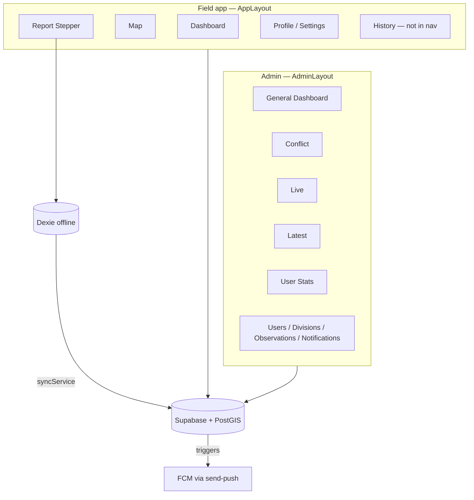

# Eravat 2.0 — Suggested Enhancements Audit

| Field | Value |
| --- | --- |
| Status | **Suggested enhancements** (not implemented) |
| Authored | 2026-05-14 |
| Scope | UX/UI, product capabilities, module placement, architecture |
| Sources | `/docs`, `eravat-app/src/`, Supabase migrations, live Supabase advisors |

> This document captures a full product and architecture audit with recommended
> changes. Items here are proposals for future work — nothing in this file
> implies shipped functionality unless separately implemented and logged in
> `docs/sessions/`.

---

## Executive summary

Eravat has a **solid core**: offline-first reporting, territory-aware RLS,
chain-of-command + proximity notifications, and a clean split between the
**field shell** (mobile bottom nav) and **admin shell** (sidebar). That matches
how the Forest Department works — beat guards file in the field; DFO/CCF need
oversight.

The biggest gaps are not missing pixels — they are **misaligned role models**,
**module placement**, and **operational trust**:

| Area | Verdict |
| --- | --- |
| Field reporting + sync | Strong foundation |
| Notifications | Good backend; weak field UX for acting on alerts |
| Admin analytics | Rich but fragmented across 5 dashboards |
| Role ↔ UI alignment | **Broken in places** (Range Officer, Biologist, CCF) |
| Auth for forest conditions | **Blocked on network** until PIN proposal ships |
| Security hardening | Recent RLS work good; geo + RPC exposure still risky |

---

## 1. Architecture map (current state)

### Strengths

- Shadow DB pattern (Dexie → normalized upsert) is the right call for interior
  forest connectivity.
- `can_read_report()` centralizes territory visibility — UI cannot accidentally
  leak data if RLS is correct.
- Edge functions for user lifecycle keep `auth.users` off the client.
- `deferredCapabilities.ts` honestly documents 14 future modules instead of
  pretending they exist.

### Structural risks

1. **Three parallel role systems** that do not always agree:
   - Route guard: `admin`, `ccf`, `dfo` only for `/admin`
   - RLS: `range_officer`, `beat_guard`, `biologist`, `veterinarian`, `rrt` have
     their own read scopes
   - Edge RBAC: who can create/edit which roles
   - `useAdminFilters`: auto-scopes `dfo` and `range_officer` — but
     **range_officer cannot reach admin routes**

2. **Docs drift**: `docs/schema.md` and parts of `ERAVAT_SOURCE_OF_TRUTH.md`
   §5.2 predate May 2026 territory hardening. Treat migrations as truth.

3. **Supabase advisors (live project)** flag:
   - **ERROR**: `geo_divisions`, `geo_ranges`, `geo_beats` — no RLS
   - **WARN**: `get_push_dispatch_auth_token()` callable by `anon`
   - **WARN**: `report_media` bucket allows broad listing
   - Many internal trigger functions exposed as RPC to `anon`/`authenticated`

---

## 2. Persona-by-persona analysis

### Beat Guard (primary field user)

**Job-to-be-done:** See elephant activity near my beat, file a report in under 2
minutes, know it will sync later, get credit for my patrol.

| What works | What hurts |
| --- | --- |
| Report stepper (counters, compass, photos) | **History** (`/history`) is not in bottom nav — easy to miss |
| Pending sync banner on Dashboard | Sync errors are English-only; no per-report failure detail |
| Offline queue | No “draft resume” if app killed mid-stepper |
| Territory on profile | No on-map “you are here vs your beat boundary” cue before filing |

**Suggested enhancements**

- Put **History** in bottom nav (replace Settings, which is already reachable
  from Profile) or add a “My reports” card on Dashboard.
- After submit: show **beat name assigned** (from server trigger) once synced —
  builds trust that GPS was understood.
- One-tap **“Conflict / loss”** entry from Dashboard (not only generic Report) —
  RRT response time matters.
- Large-type mode for sunlit outdoor use (optional setting).

---

### Range Officer

**Job-to-be-done:** Monitor all beats in my range, respond to proximity alerts,
supervise beat guards, escalate to DFO.

| What works | What hurts |
| --- | --- |
| RLS gives range-scoped report reads | **No `/admin` access** despite `useAdminFilters` treating RO like DFO |
| Proximity notifications (server) | Must use field Dashboard + Territory History — no range KPI view |
| Can assign beat guards (RLS on assignments) | User management buried in admin they cannot open |

**This is the single largest product misalignment.** Docs say RO “manages Beat
Guards” and “receives proximity alerts,” but the Command Center is locked to
`admin | ccf | dfo`.

**Suggested enhancements**

- Add **`range_officer` (and possibly `rrt`) to `ADMIN_ROLES`** with a **reduced
  nav**:
  - Live, Latest, Observations, Users (scoped), Notifications (read)
  - Hide: Divisions edit, global settings, deferred modules
- Or: new **`/supervisor`** shell — lighter than full admin, range-scoped by
  default.
- Dashboard card: “**3 new alerts in your range**” linking to filtered History.

---

### DFO (Division Forest Officer)

**Job-to-be-done:** Division-wide situational awareness, personnel oversight,
conflict escalation, brief CCF.

| What works | What hurts |
| --- | --- |
| Admin access + division auto-scope in filters | Five dashboards overlap (General / Live / Latest / Conflict / Observations) |
| Can manage RO/BG via edge functions + RLS | No export (PDF/Excel) for division briefings |
| Chain-of-command notifications | “Active Conflicts” KPI counts all loss reports in 30d — not “open incidents” |

**Suggested enhancements**

- Consolidate admin into **3 hubs**:
  1. **Situation** (map + live feed + conflict KPIs) — merge Live + Conflict +
     map from General
  2. **Records** (searchable observations table) — Latest + Observations
  3. **Administration** (users, divisions, notifications, settings)
- Add **incident status** workflow (`open → responding → resolved`) — today
  `sync_status` is sync workflow, not operational workflow.
- Division briefing export (weekly PDF) is high value for forest department
  culture.

---

### CCF (Chief Conservator of Forests)

**Docs say:** “Read-only global analytics, state-level monitoring.”

**Reality:** CCF has full `/admin` route access same as `admin` — only RBAC on
user mutations differs at the edge function layer. UI does not enforce
read-only.

**Suggested enhancements**

- `AdminRoute` should accept a **permission matrix**, not just role names:
  - CCF: all dashboards, no Users write, no Divisions write, no Notifications
    send
- State-level rollup when multiple divisions exist (filter default = “all
  divisions”).

---

### Biologist / Veterinarian / RRT

**RLS:** Division-scoped read via `can_read_report()` (like DFO for data).

**UI:** No dedicated research or response views. They use the same field app as
beat guards.

**Suggested enhancements**

- **Biologist lens**: cohort metrics (calf %, herd composition trends) already
  exist as KPI cue cards on Admin Dashboard — expose a **read-only Research**
  view (no admin shell required, or CCF-style read admin).
- **Veterinarian lens**: conflict injuries, human injury/death counts — tie to
  `AdminConflictDashboard` metrics with injury detail drill-down.
- **RRT lens**: real-time conflict queue + map + “navigate to GPS” — operational,
  not analytics. Belongs in field app or a slim **Response** module, not buried
  in admin tables.

---

### Volunteer

**Docs:** “Citizen reporting; own submissions only.”

**Reality:** Same report flow as staff; RLS limits reads to own reports. No
simplified citizen UX, no moderation queue for admin.

**Suggested enhancements**

- Simpler report path (fewer steps, no compass unless needed).
- Admin **Volunteer submissions** queue with approve/reject before entering
  chain-of-command (otherwise noise floods DFO).

---

### System Admin

**Works well:** Users, Divisions, deferred capability honesty, MFA on admin
settings.

**Gaps:** No audit log UI (`audit_log` table exists). No device registry (planned
in `AUTH_ARCHITECTURE.md`). `docs/README.md` still references `MobilePatrol.tsx`
— likely orphaned.

---

## 3. Module placement audit

| Module | Current location | Verdict | Suggested change |
| --- | --- | --- | --- |
| Report filing | `/report` (FAB) | Correct | Add quick actions on Dashboard |
| Map | `/map` | Correct | Merge territory boundary + “my beat” layer; i18n missing |
| Territory history | `/history` (hidden) | **Wrong prominence** | Nav item or Dashboard feed |
| Notifications | Header bell only | **Under-powered** | Full inbox page + tap → report on map |
| Sync status | Dashboard | Correct | Add failed-report detail screen |
| Admin analytics | 5 separate routes | **Overlapping** | Consolidate to 3 hubs |
| User management | `/admin/users` | Correct for admin/DFO | Extend read-only/scoped for RO |
| Geography | `/admin/divisions` | Correct | Field users shouldn’t need it |
| Observations table | `/admin/observations` | Overlaps Latest | Single searchable registry |
| Settings | Bottom nav + profile | Redundant entry | Keep one path (Profile → Settings) |
| Help / FAQ / Privacy | Profile subtree | Correct | Link from Login for first-time users |
| Deferred (14 items) | Admin nav (6 shown) | Good transparency | Move to “Roadmap” page, not fake nav items |

---

## 4. UX / UI recommendations (cross-cutting)

### P0 — Trust & field reliability

1. **Ship auth increment from `AUTH_ARCHITECTURE.md`** — PIN unlock + MSG91 DLT.
   Daily OTP in forest is a workflow killer; this is the highest-impact UX
   change.
2. **Unified sync feedback** — per-report status: pending / syncing / failed
   (with reason) / synced + beat assigned.
3. **Notification → action** — tapping alert opens report on map with “Call RO” /
   “Mark acknowledged” (even if call is deferred).
4. **Fix i18n gaps** — `MapPage`, sync messages, loaders, session expiry banner
   (`BUG-012`), Dashboard Hindi subtitle always shown regardless of selected
   language.

### P1 — Information architecture

5. **Role-aware home screen** — Dashboard content blocks by role (guard vs RO vs
   DFO), not one generic welcome.
6. **Reduce admin dashboard sprawl** — one Situation view with time window chips
   (already on Live).
7. **CCF read-only mode** in UI.
8. **Range Officer supervisor access** — align route guard with RLS and docs.

### P2 — Polish & scale

9. **Web push** for RO/DFO on desktop command centers (today push is
   Capacitor-native only).
10. **KML / corridor overlays** (deferred) — high forest dept value for elephant
    routes.
11. **Villager / crowd reporting** (deferred) — separate channel, not mixed
    into personnel report stepper.
12. **Category master** — forest departments often need configurable damage types
    without migrations.

### UI specifics (forest department context)

- **High contrast outdoor mode** — stronger borders on cards, less reliance on
  subtle glass/blur.
- **Thumb-zone** — Report FAB is good; secondary actions (History, Sync) should sit
  above bottom nav consistently.
- **Hierarchical labels** — always show `Beat → Range → Division` on reports
  (partially done in History).
- **Conflict severity visual language** — human death/injury should use
  unmistakable styling everywhere (Live dashboard does this partially).

---

## 5. Feature capability matrix

| Capability | Status | Forest dept value |
| --- | --- | --- |
| Direct / indirect / conflict reporting | Built | Core |
| Offline sync | Built | Core |
| Beat auto-assignment + nearest fallback | Built | Core |
| Proximity + chain-of-command alerts | Built | Core |
| Push (Android) | Built | High |
| Admin KPIs + role cue cards | Built | High |
| Phone OTP + password login | Built | Medium (cost/UX issues) |
| PIN offline unlock | **Proposed only** (`AUTH_ARCHITECTURE.md`) | Critical |
| Range Officer command view | **Missing** | Critical |
| Incident lifecycle (open/resolved) | Missing | High |
| Export / briefing reports | Missing | High |
| Villager reporting | Deferred | Medium |
| KML overlays | Deferred | High for planning |
| Voice call alerts | Deferred | Medium (RRT) |
| Device management | Deferred | Medium |
| ODK forms | Deferred | Low if stepper suffices |

See also: `eravat-app/src/admin/deferredCapabilities.ts` for the full deferred
registry.

---

## 6. Admin dashboard overlap

| Page | Primary question | Overlap |
| --- | --- | --- |
| `/admin` General | 30d KPIs, role cues, map, alerts feed | Map + feed overlap Live |
| `/admin/live` | Time-window activity + map + table | Subset of General with better windows |
| `/admin/latest` | Recent entries table | Same data as Observations, narrower |
| `/admin/conflict` | Loss/damage analytics | Should be a **filter on Situation**, not separate product |
| `/admin/observations` | Full observation registry | Canonical “Records” view |
| `/admin/user-stats` | Personnel activity | Fits under Administration or Analytics |

**Suggested enhancement:** Make **Live** the default admin landing (`/admin` →
redirect or embed). Demote General to legacy or merge.

Metric formulas: `docs/DASHBOARD_METRICS_REFERENCE.md`.

---

## 7. Security & architecture hardening

1. **Enable RLS on `geo_*`** with read policies scoped by role/assignment — today
   any authenticated user can enumerate all divisions statewide.
2. **Revoke EXECUTE on internal RPCs** from `anon`/`authenticated` except
   intentional public RPCs (`get_email_by_phone`, `validate_phone_for_otp`).
   Especially `get_push_dispatch_auth_token`, notification triggers,
   `assign_report_geography`.
3. **Tighten `report_media` storage policies** — prevent bucket listing.
4. **Enable leaked password protection** in Supabase Auth.
5. **Custom access token hook** (from `AUTH_ARCHITECTURE.md`) — embed
   `user_role`, `is_active`, territory claims; reduces client profile round-trips
   and enables consistent UI gating.
6. **Consolidate migration folders** — `/supabase/migrations/` vs
   `/eravat-app/supabase/migrations/` split noted in `AUTH_ARCHITECTURE.md`.

---

## 8. Prioritized roadmap (suggested)

### Phase A — Align roles with reality (2–3 weeks)

- Range Officer supervisor shell (scoped admin)
- CCF read-only UI enforcement
- History in primary navigation
- Notification inbox + deep link to map/report

### Phase B — Field officer daily UX (4–6 weeks)

- `AUTH_ARCHITECTURE.md` Increment 1–3 (MSG91 + PIN unlock)
- Sync failure detail UI
- Role-aware Dashboard
- i18n completion for field paths

### Phase C — Command & control (4–6 weeks)

- Merge admin dashboards into Situation / Records / Admin
- Incident status workflow (`open` / `responding` / `resolved`)
- Division export / briefing PDF
- Web push for desktop monitors

### Phase D — Ecosystem (later)

- Villager channel (separate app surface)
- KML corridors, affected villages registry
- Voice / SMS escalation for RRT

---

## 9. What is already well aligned

- **Report stepper in field app, analytics in admin** — correct separation.
- **Territory History concept** — right feature, wrong discoverability.
- **Deferred capabilities registry** — excellent stakeholder communication.
- **DFO division scoping in `useAdminFilters`** — matches how divisions think.
- **Multi-language investment (en/hi/mr)** — critical for MP forest staff; finish
  the edges.
- **Offline-first data path** — matches the mission in
  `ERAVAT_SOURCE_OF_TRUTH.md`.

---

## 10. Related documentation

| Document | Relevance |
| --- | --- |
| `ERAVAT_SOURCE_OF_TRUTH.md` | Vision, personas, stack |
| `AUTH_ARCHITECTURE.md` | PIN unlock + MSG91 proposal |
| `DASHBOARD_METRICS_REFERENCE.md` | Admin KPI formulas |
| `SYNC_RUNBOOK.md` | Offline sync troubleshooting |
| `schema.md` | DB reference (partially stale — verify against migrations) |

---

## Change log

| Date | Change |
| --- | --- |
| 2026-05-14 | Initial suggested enhancements audit |
