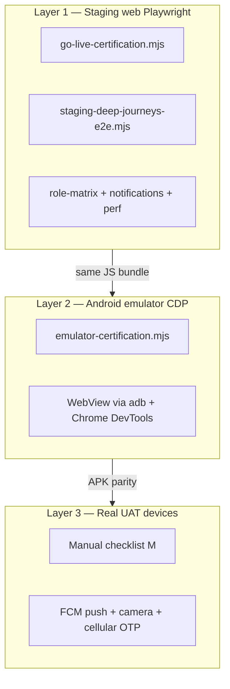

# Testing automation architecture

Eravat uses **one React bundle** for web and APK. Automation is layered so each gap has a primary tool and a fallback.

## Three layers



| Gap | Layer 1 (web) | Layer 2 (emulator) | Layer 3 (device) |
|-----|---------------|--------------------|------------------|
| Report submit + history | `staging-deep-journeys-e2e.mjs` + `tests/report.spec.ts` | CDP report flow + **Use test photo** (staging build) | Camera capture, GPS accuracy |
| Villager onboard/list | `staging-deep-journeys-e2e.mjs` | Same via WebView | Field tester sign-off |
| Villager edit/delete | N/A — **no UI** | N/A | Product decision |
| Offline → sync | Playwright `setOffline` + route abort | `adb shell svc wifi/data disable` | Airplane mode on APK |
| Damage wizard | Deep journeys + `prod-readiness-e2e.mjs` | Emulator CDP | Manual spot-check |
| Perf / load | `staging-perf-full-smoke.mjs`, `staging-load-50.mjs` | Optional repeat on emulator | Soak on 3G |
| Push (FCM) | DB + `send-push` config only | Not available without `google-services.json` | **Required on device** |
| SMS/voice dummy queue | `staging-notification-alerts-e2e.mjs` + Supabase | Same backend | Verify admin log |

## Commands

```bash
cd eravat-app

# Layer 1 — full web certification (~30 min)
npm run test:certify

# Layer 1 — deep flows only
npm run test:staging:deep

# Layer 2 — build APK + boot Eravat_E2E + CDP tests (~15 min first time)
npm run test:android:certify

# Layer 1 + 2 combined
npm run test:certify:emulator

# Layer 2 — all API levels (compat smoke)
npm run test:android-compat:avds   # create Eravat_API* if missing
npm run test:android-compat
npm run test:android-perf          # CDP login+report timings on API 27 + 31
```

**Prerequisites**

- UAT seed: `node scripts/seed-uat-testers-from-sheet.mjs`
- Android SDK + cmdline-tools (`sdkmanager`). Create compat AVDs with `npm run test:android-compat:avds` (API **24 / 27 / 28 / 31 / 33 / 35**). They are **not** pre-installed; primary cert AVD is `Medium_Phone_API_36.0` (or `Eravat_E2E` when present).
- Staging test photo: `VITE_APP_ENV=staging` shows **Use test photo** on report step (no camera needed)

## What each layer catches

**Layer 1** validates business logic, RBAC, Command Center, notifications, report wizard, Dexie offline queue (simulated), and villager RPCs against live staging Supabase.

**Layer 2** validates Capacitor WebView, APK install, cold start, session restore, adb network toggles, and staging bundle embedded in the APK. Uses Chrome DevTools Protocol on the WebView (`emulator-e2e-playwright.mjs`). Compat smoke + `emulator-perf-smoke.mjs` cover older APIs; full Maestro stays on API 36. Capacitor `minWebViewVersion` is **69** — older System WebViews must show `outdated-webview.html` (compat treats that as PASS).

**Layer 3** is still required for: real camera, FCM delivery, Twilio OTP in prod, and field UX on **Vivo FunTouch** (T3/T4/Y400/V70) and Samsung A15 from the UAT sheet. Stock Google AVDs do not emulate FunTouch OEM skins.

## Tooling installer

```bash
cd eravat-app
npm run test:setup-tooling          # audit only
node scripts/setup-test-tooling.mjs --install   # fetch staging service role, Playwright Chromium, scrcpy, Maestro
```

**Auto-installed on this machine:** Playwright Chromium, Maestro, staging `SUPABASE_SERVICE_ROLE_KEY` (via Supabase CLI), certification output dirs, optional scrcpy → `~/.local/bin/scrcpy`.

**Still requires manual credentials (cannot be installed):**

| Gap | What you must provide |
|-----|------------------------|
| FCM push delivery | `google-services.json` + `FCM_SERVICE_ACCOUNT_JSON` on staging — see [FCM_AND_DEVICE_SETUP.md](./FCM_AND_DEVICE_SETUP.md) |
| Real device shade notification | Physical UAT phone with APK + FCM |
| Cellular / Twilio OTP | Prod only — staging uses Test OTP |
| Villager edit/delete | Product UI not built yet |
| Homebrew | Not in PATH — scrcpy installed to `~/.local/bin` instead |

**Coverage without FCM file:** in-app bell, DB notification chain, dummy SMS queue, `send-push` invoke (returns `skipped: FCM not configured` until secrets are set).


See `.cursor/rules/test-suite-maintenance.mdc` — any feature change must extend the closest script in Layer 1 and update `docs/testing/GO_LIVE_CERTIFICATION.md`.

## Emulator notes (this machine)

- `adb devices` — start with `emulator -avd Eravat_E2E`
- APK path: `eravat-app/android/app/build/outputs/apk/debug/app-debug.apk`
- After web changes: `npm run build:android:staging && cd android && ./gradlew assembleDebug`
- Emulator OTP: UAT manifest (`uat-testers-otp-manifest.json`), not hardcoded `123456`
